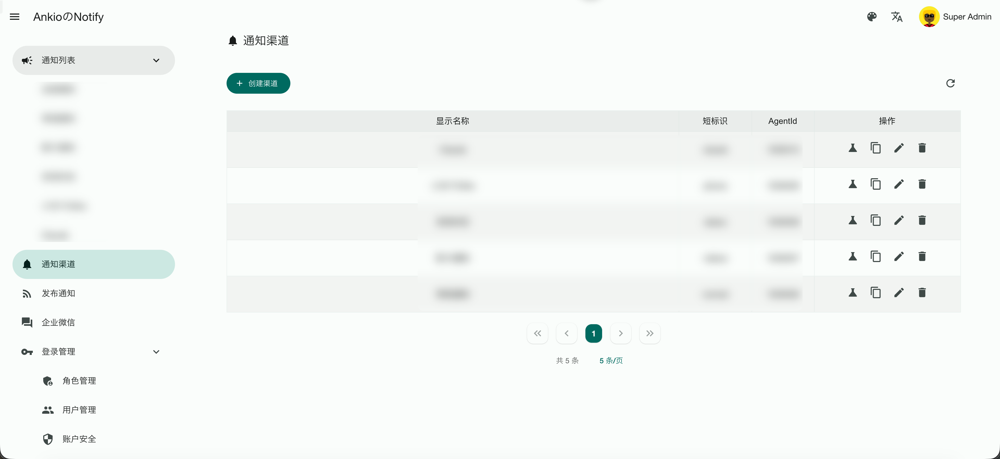
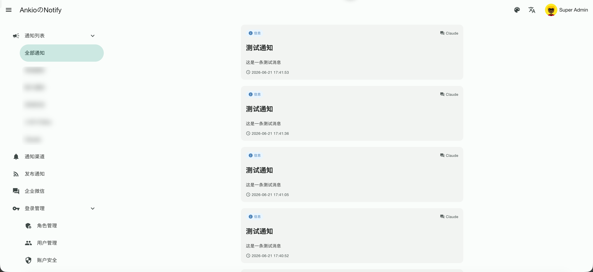
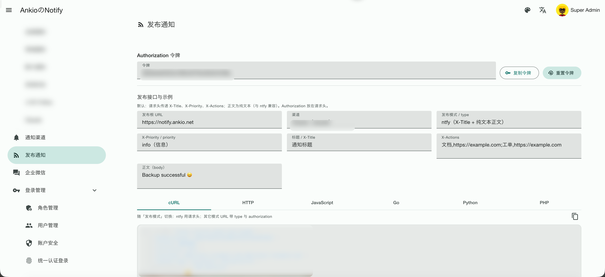
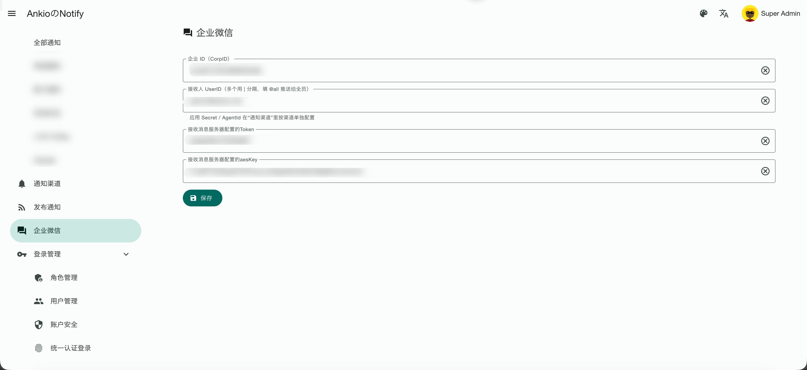
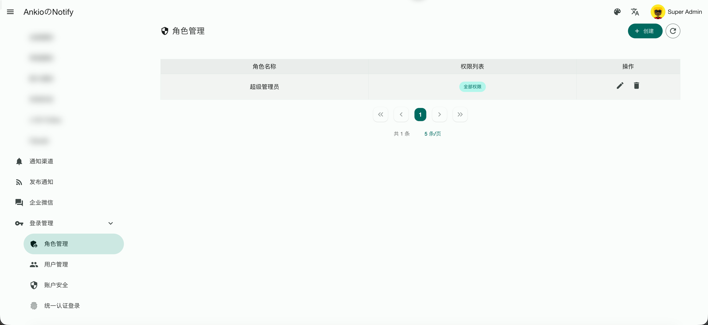
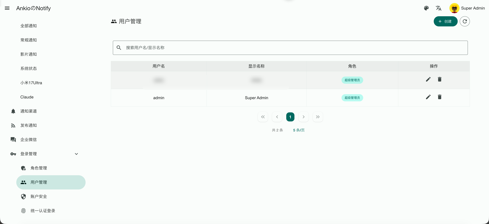
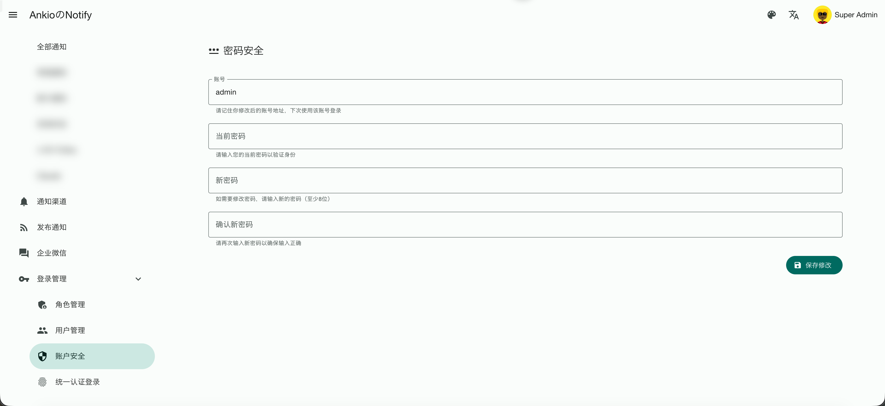
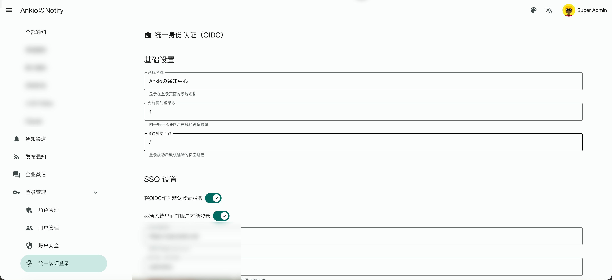

<p align="center">
  
</p>

<h1 align="center">Ankio Notify</h1>

<p align="center">轻量通知中心 — HTTP 发布、短链详情、后台管理；可选推送到企业微信应用。</p>

---

## 快速上手

```
安装 → 创建渠道 → 复制 Authorization → POST /{渠道短标识} 发通知
```

| 步骤 | 做什么 | 在哪 |
|------|--------|------|
| 1 | 部署并访问 `/install` 完成安装 | 浏览器 |
| 2 | 新建渠道，记下**短标识**（如 `ops`） | 后台 → 通知渠道 |
| 3 | 复制 **Authorization** 令牌 | 后台 → 发布通知 |
| 4 | 向 `POST /{短标识}` 发请求 | cURL / 脚本 / 钉钉飞书 Webhook |
| 5 | 查看历史、短链详情 | 后台 → 通知列表 / `GET /{short_url}` |

---

## 部署

**环境：** PHP 8.0+（含 `pdo_mysql`）、MySQL 8、Nginx（或同类）+ PHP-FPM。

- 网站根目录指向 **`src/public`**
- **`src/runtime`** 需可写
- MySQL **先建好空数据库**（安装向导不会替你建库）

Nginx 伪静态：

```nginx
rewrite ^(.*)$ /index.php/$1 last;
```

---

## 安装

浏览器打开 **`/install`**，填写数据库与站点信息。

- **Authorization** 留空时会随机生成 — **装完后务必保存**，发通知时要带上
- 安装完成后登录后台（默认管理员账号在安装时设置）

---

## 使用方法

### 1. 创建通知渠道

后台 **通知渠道 → 创建渠道**：

| 字段 | 说明 |
|------|------|
| **显示名称** | 后台展示用 |
| **短标识** | URL 路径，如 `ops` → 发布地址为 `POST /ops` |
| **AgentId / Secret** | 可选；填写后该渠道的通知会推送到企业微信（见下文） |

创建后可在列表中 **复制 Webhook URL**（已含 `type` 与 `authorization` 查询参数，适合钉钉、飞书等只填 URL 的场景）。

### 2. 获取 Authorization

后台 **发布通知** 页：

- 查看、复制当前 **Authorization 令牌**
- 需要时可 **重置令牌**（重置后所有旧客户端须更新）

鉴权方式（二选一）：

- 请求头：`Authorization: <令牌>`
- 查询参数：`?authorization=<令牌>`（与 `type` 一起用于 Webhook URL）

### 3. 发布通知

**统一入口：** `POST https://你的域名/{短标识}`

用查询参数 **`type`** 选择载荷格式；省略时默认为 **`ntfy`**（与 ntfy 风格兼容）。

| `type` | 适用场景 | 载荷方式 |
|--------|----------|----------|
| **`ntfy`**（默认） | 自建脚本、ntfy 兼容客户端 | 请求头 + 纯文本正文 |
| **`dingding`** | 钉钉自定义机器人 | JSON：`msgtype` + `text.content` |
| **`feishu`** | 飞书机器人 | JSON：`msg_type` + `content.text` |
| **`wechat`** | 企业微信机器人 | JSON：`msgtype` + `text.content` |
| **`form`** | HTML 表单 / 简单 POST | 字段 `title`、`message`、`priority` |
| **`json`** | 通用 HTTP API | JSON 正文：`title`、`message`、`priority` |

**响应格式**会按 `type` 贴近各平台习惯（钉钉/企微返回 `errcode`/`errmsg`，飞书返回 `code`/`msg` 等），避免接入方把成功误判为失败。

#### 3.1 ntfy 模式（默认，推荐脚本接入）

`Authorization` 放请求头；`type` 可省略。

```bash
curl -X POST "https://你的域名/ops" \
  -H "Authorization: 你的令牌" \
  -H "X-Title: 备份完成" \
  -H "X-Priority: success" \
  -H "X-Actions: 面板,https://a.com;日志,https://a.com/logs;" \
  --data-binary "数据库备份已成功，耗时 3 分钟"
```

| 请求头 | 说明 |
|--------|------|
| `X-Title` | 通知标题 |
| `X-Priority` | `info` / `warning` / `error` / `success`（也支持 ntfy 数值 1–5） |
| `X-Actions` | 操作按钮，多段用 **`;`** 分隔，每段 **`名称,URL`** |

成功响应示例：

```json
{"msg":"Success","code":200,"data":{...}}
```

#### 3.2 钉钉 / 飞书 / 企微机器人模式

鉴权放在 URL 查询参数（Webhook 无法自定义请求头时使用）：

```bash
# 钉钉
curl -X POST "https://你的域名/ops?type=dingding&authorization=你的令牌" \
  -H "Content-Type: application/json" \
  -d '{"msgtype":"text","text":{"content":"备份完成\n数据库备份已成功"}}'

# 飞书
curl -X POST "https://你的域名/ops?type=feishu&authorization=你的令牌" \
  -H "Content-Type: application/json" \
  -d '{"msg_type":"text","content":{"text":"备份完成\n数据库备份已成功"}}'

# 企业微信机器人
curl -X POST "https://你的域名/ops?type=wechat&authorization=你的令牌" \
  -H "Content-Type: application/json" \
  -d '{"msgtype":"text","text":{"content":"备份完成\n数据库备份已成功"}}'
```

正文 **第一行作为标题**，其余为消息体（与钉钉/飞书习惯一致）。正文中的 URL 会自动提取为操作链接。

#### 3.3 form / json 模式

```bash
# form
curl -X POST "https://你的域名/ops?type=form&authorization=你的令牌" \
  -d "title=备份完成&message=数据库备份已成功&priority=success"

# json
curl -X POST "https://你的域名/ops?type=json&authorization=你的令牌" \
  -H "Content-Type: application/json" \
  -d '{"title":"备份完成","message":"数据库备份已成功","priority":"success"}'
```

#### 3.4 后台代码示例

**发布通知** 页可按模式切换 **cURL / 原始 HTTP / JavaScript / Go / Python / PHP** 示例，改字段即同步更新代码，直接复制使用。

#### 3.5 查看通知详情

- 后台 **通知列表** 按渠道筛选、查看历史
- 短链：`GET /{short_url}`（发布成功响应 `data` 中的 `short_url` 字段）
- 公开页：`GET /notify/{channel}` 查看某渠道的通知流

### 4. 企业微信应用推送（可选）

除 Webhook 入库外，还可把通知 **主动推送到企业微信成员**。

**企业微信后台：**

1. 记下 **企业 ID（corpid）**
2. 自建应用：记下 **AgentId、Secret**，成员加入可见范围
3. 添加回调：**URL `https://你的域名/hook`**，Token、`EncodingAESKey` 自定（须公网可访问）
4. 发 API 的出口 IP 加入 **可信 IP**

**Notify 后台 → 企业微信：**

| 配置项 | 说明 |
|--------|------|
| `corpid` | 企业 ID |
| `to_user` | 接收人 UserID，多个用 **\|** 分隔，填 `@all` 推全员 |
| `token` / `aes_key` | 与回调配置一致 |

**通知渠道** 中为每条渠道填写对应的 **`agent_id`、`secret`**。推送条件：全局 `to_user` 非空且该渠道两项均已配置；**收件人共用全局 `to_user`**。

> 企微上游 API 失败时 HTTP 可能仍为 200，请看 JSON 里的 `code` / `msg`（或 `errcode` / `errmsg`）。

---

## 截图

### 通知渠道

创建与管理发布渠道，复制带 `type`、`authorization` 的 Webhook URL。



### 通知列表

按渠道查看历史通知，支持优先级标签与操作链接。



### 发布通知

配置参数并生成 cURL / HTTP / JS / Go / Python / PHP 示例代码。



### 企业微信

配置 corpid、接收人、回调 Token / aesKey。



### 角色管理

RBAC 角色与权限配置。



### 用户管理

后台用户与角色分配。



### 账户安全

修改管理员密码。



### 统一认证登录

OIDC 单点登录配置。



---

## 开发

```bash
npm run build   # 构建前端资源
npm run test    # 运行测试
npm run fix     # PHP-CS-Fixer 格式化
```

**License：** MIT
